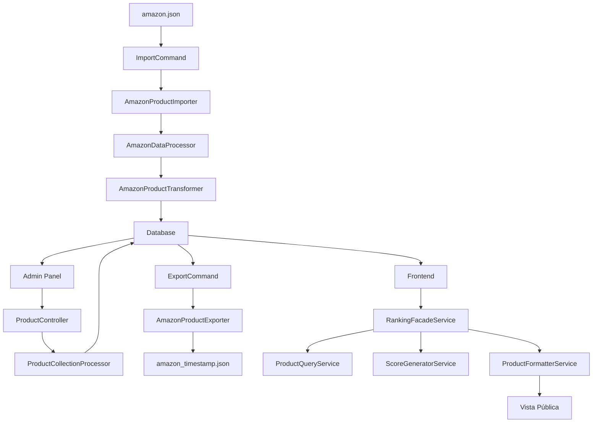

# 🛒 Sistema de Gestión de Productos Amazon

### Symfony 6.4 - Aplicación de Práctica Profesional (Prueba Técnica)

[](https://symfony.com/)
[](https://php.net/)
[](https://doctrine-project.org/)
[](LICENSE)

---

## 📋 Índice

- [Descripción del Proyecto](#-descripción-del-proyecto)
- [Arquitectura y Patrones](#-arquitectura-y-patrones)
- [Modelo de Negocio](#-modelo-de-negocio)
- [Estructura de Base de Datos](#-estructura-de-base-de-datos)
- [Instalación](#-instalación)
- [Comandos de Consola](#-comandos-de-consola)
- [Servicios Principales](#-servicios-principales)
- [Flujo de Trabajo](#-flujo-de-trabajo)
- [Panel Administrativo](#-panel-administrativo)
- [Frontend Público](#-frontend-público)
- [Contribución](#-contribución)

---

## 🎯 Descripción del Proyecto

Este proyecto es una **aplicación Symfony 6.4** desarrollada como **prueba técnica** para **Widitrade**, demostrando la implementación
de principios SOLID, patrones de diseño y buenas prácticas de desarrollo.

### 🏗️ Contexto de Desarrollo

Hace unos meses, cuando decidí probar Symfony 6, desarrollé un **proyecto base** que tuviera lo que, para mí, es lo más básico que deben contener casi todas las aplicaciones:

- ✅ Sistema completo de autenticación de usuarios (login/registro)
- ✅ Gestión de contraseñas y recuperación por email
- ✅ Panel administrativo con autenticación separada
- ✅ CRUDs para administradores, usuarios y contactos
- ✅ Comando personalizado `make:d-crud` para generación dinámica de CRUDs
- ✅ Sistema de envío de emails y formulario de contacto

**Partiendo de esta base, desarrollé completamente:**

- 🆕 **Sistema de importación/exportación de productos Amazon**
- 🆕 **Arquitectura de servicios especializados con interfaces**
- 🆕 **Sistema de ranking y valoración de productos**
- 🆕 **Frontend público para visualización de productos**
- 🆕 **Gestión completa de productos con imágenes, precios y rankings**

### 🎯 Objetivo Principal

Crear un **sistema completo de gestión de productos** que permita:

1. **Importar** datos de productos desde un archivo JSON de Amazon
2. **Gestionar** y modificar productos a través de un panel administrativo
3. **Exportar** datos modificados manteniendo la estructura original de Amazon
4. **Visualizar** productos en un frontend público con sistema de ranking

---

## 🏛️ Arquitectura y Patrones

### 🎨 Principios SOLID Implementados

#### **Single Responsibility Principle (SRP)**

- `AmazonProductImporter` → **Solo** importa productos
- `AmazonProductExporter` → **Solo** exporta productos
- `ProductFormatterService` → **Solo** formatea datos para vista
- `ScoreGeneratorService` → **Solo** genera puntuaciones y ratings

#### **Open/Closed Principle (OCP)**

- Uso de **interfaces** para extensibilidad futura
- Fácil adición de nuevas plataformas sin modificar código existente

#### **Interface Segregation Principle (ISP)**

- Interfaces específicas y cohesivas
- `AmazonProductImporterInterface`, `ProductFormatterServiceInterface`, etc.

#### **Dependency Inversion Principle (DIP)**

- Controladores dependen de **abstracciones**, no implementaciones
- Inyección de dependencias configurada en `services.yaml`

### 🔧 Patrones de Diseño

- **🎭 Facade Pattern**: `RankingFacadeService` simplifica operaciones complejas
- **⚡ Command Pattern**: Comandos de consola bien estructurados
- **📦 Repository Pattern**: Repositories específicos por entidad
- **💎 Value Objects**: `AmazonProductData`, `ExportResult`, `ImportResult`
- **🔥 Exception Handling**: Excepciones específicas por contexto

---

## 💼 Modelo de Negocio

### 🎯 Caso de Uso Principal: **Gestión de Ranking de Productos**

```
    A (Amazon.json) --> B (Importación)
    
    B --> C (Base de Datos)
    C --> D (Panel de Administración)
    D --> C
    C --> E (Exportación)
    E --> F (JSON Modificado)
    C --> G (Frontend)
```

### 📊 Funcionalidades Clave

1. **Importación Inteligente**
    - Procesamiento de datos JSON complejos de Amazon
    - Validación y transformación de datos
    - Gestión de relaciones entre entidades

2. **Gestión Administrativa**
    - CRUD completo de productos con interfaz visual
    - Manejo de colecciones (imágenes, precios, rankings)
    - Sistema de validación y errores

3. **Exportación Fiable**
    - Mantenimiento de estructura original de Amazon
    - Inclusión de modificaciones realizadas
    - Generación de archivos con timestamp
    - Estructura válida para devolver a Amazon vía API, si existiera el caso.

4. **Frontend Dinámico**
    - Sistema de ranking inteligente
    - Cálculo de puntuaciones automático
    - Interfaz responsive y accesible

---

## 🗄️ Estructura de Base de Datos

### 📋 Entidades Principales

#### **Product** (Entidad Central)

```php
- id: int (PK)
- asin: string (Unique - Amazon Standard Identification Number)
- title: string
- slug: string (Unique)
- brand: string
- manufacturer: string
- amazonUrl: text
- features: JSON array
- sourceData: JSON (datos originales)
- isActive: boolean
- createdAt, updatedAt
```

#### **ProductImage** (1:N con Product)

```php
- id: int (PK)
- product_id: int (FK)
- url: string
- width, height: int
- isPrimary: boolean
- type: string (large, medium, small)
- orderPosition: int
- altText: string
```

#### **ProductPrice** (1:N con Product)

```php
- id: int (PK)
- product_id: int (FK)
- listingId: string
- amount: decimal
- currency: string
- displayAmount: string
- savingsAmount, savingsPercentage: decimal
- isFreeShipping: boolean
```

#### **ProductRanking** (1:N con Product)

```php
- id: int (PK)
- product_id: int (FK)
- categoryId: string
- categoryName: string
- contextFreeName: string
- salesRank: int
- isRoot: boolean
- rankingDate: date
```

#### **Entidades de Sistema**

- **User**: Usuarios del frontend
- **Admin**: Administradores del panel
- **Contact**: Mensajes de contacto

### 🔗 Relaciones

```
Product (1) ←→ (N) ProductImage
Product (1) ←→ (N) ProductPrice  
Product (1) ←→ (N) ProductRanking
User (1) ←→ (N) Contact
```

### 📊 Diagrama Entidad-Relación


*Diagrama completo mostrando todas las entidades, atributos y relaciones de la base de datos del sistema.*

---

## 🚀 Instalación

### 📋 Prerrequisitos

- **Docker**
- **PHP 8.2+**
- **Composer**
- **MySQL**
- **Symfony CLI** (recomendado)

### 🔧 Pasos de Instalación

```bash
# 1. Clonar el repositorio
git clone https://github.com/ramoned-mr/widitrade-testing-app.git

# 2. Instalar dependencias
composer install

# 3. Montar la base de datos y cambiar las variables de entorno de conexión
```

### 📁 Estructura de Archivos Requerida

```
config/data/amazon/
├── amazon.json          # Archivo JSON fuente (requerido para importación)
└── exports/            # Directorio para archivos exportados (se crea automáticamente)
```

---

## 🔧 Comandos de Consola

### 📥 `app:import:amazon-products`

**Propósito**: Importa productos desde el archivo JSON de Amazon a la base de datos.

```bash
php bin/console app:import:amazon-products
```

**Características**:

- ⚠️ **Confirmación obligatoria** - Previene sobrescritura accidental
- 🔄 **Actualización forzada** - Sobrescribe productos existentes
- 📊 **Estadísticas detalladas** - Muestra métricas de importación
- 🐛 **Manejo de errores** - Registra y muestra errores por producto
- 📝 **Logging completo** - Registra todo el proceso

**Flujo de Ejecución**:

1. Validación de archivo `config/data/amazon/amazon.json`
2. Confirmación del usuario (protección contra sobrescritura)
3. Procesamiento de datos JSON
4. Transformación a entidades Doctrine
5. Persistencia en base de datos
6. Reporte de resultados

**Salida Ejemplo**:

```
+-------------------+-------+
| Métrica           | Valor |
+-------------------+-------+
| Total procesados  | 50    |
| Importados nuevos | 30    |
| Actualizados      | 20    |
| Omitidos          | 0     |
| Fallidos          | 0     |
+-------------------+-------+
```

### 📤 `app:export:amazon-products`

**Propósito**: Exporta productos modificados desde la base de datos a un archivo JSON con formato Amazon.

```bash
php bin/console app:export:amazon-products
```

**Características**:

- 📅 **Nombres automáticos** - Archivos con timestamp (`amazon_21-08-2025__14-30-15.json`)
- 🎯 **Solo productos activos** - Filtra productos según estado
- 🔄 **Estructura Amazon** - Mantiene formato original de Amazon API
- 📁 **Organización automática** - Guarda en `config/data/amazon/exports/`
- 📏 **Métricas completas** - Estadísticas de exportación

**Flujo de Ejecución**:

1. Consulta productos activos de la base de datos
2. Transformación inversa a formato Amazon
3. Construcción de estructura JSON completa
4. Validación de ruta de exportación
5. Escritura de archivo con formato pretty-print
6. Reporte de métricas

### 🏗️ `make:d-crud`

**Propósito**: Generador personalizado para crear CRUDs dinámicos en el panel administrativo.

```bash
php bin/console make:d-crud [EntityName]

# Ejemplo:
php bin/console make:d-crud Product
```

**Lo que genera**:

- 📁 **Controlador**: `src/Controller/Admin/EntityName/EntityNameController.php`
- 📝 **Formulario**: `src/Form/Admin/EntityName/EntityNameType.php`
- 🎨 **Templates**: Vistas completas CRUD en `templates/admin/entityname/`
    - `index.html.twig` - Listado con DataTables
    - `_new.html.twig` - Formulario de creación
    - `_edit.html.twig` - Formulario de edición
    - `_show.html.twig` - Vista detalle
    - `_delete.html.twig` - Confirmación de eliminación

**Características Avanzadas**:

- 🔍 **Detección automática** de propiedades de entidad
- 🎯 **Formularios inteligentes** - Campos apropiados por tipo de dato
- 🔗 **Relaciones automáticas** - EntityType para relaciones
- 📱 **Templates responsivos** - CSS y JS incluidos
- ⚡ **DataTables integrado** - Búsqueda, paginación y ordenamiento

---

## 🔧 Servicios Principales

### 🏭 Servicios de Importación

#### **AmazonProductImporter**

```php
interface AmazonProductImporterInterface
{
    public function importProducts(string $jsonData, bool $forceUpdate, ?int $limit): ImportResult;
}
```

**Responsabilidades**:

- Validación de JSON de Amazon
- Transformación de datos a entidades
- Manejo de productos duplicados
- Generación de métricas de importación

#### **AmazonDataProcessor**

```php
interface AmazonDataProcessorInterface  
{
    public function processItems(array $items): array;
    public function reverseProcessItems(array $items): array;
}
```

**Responsabilidades**:

- Procesamiento bidireccional de datos
- Validación de estructura Amazon
- Normalización de datos

#### **AmazonProductTransformer**

```php
interface AmazonProductTransformerInterface
{
    public function transformToAmazonProductData(array $item): AmazonProductData;
    public function transformFromProduct(Product $product): array;
}
```

**Responsabilidades**:

- Transformación entre formatos
- Mapeo de campos complejos
- Preservación de datos originales

### 📤 Servicios de Exportación

#### **AmazonProductExporter**

```php
interface AmazonProductExporterInterface
{
    public function exportProducts(string $filePath): ExportResult;
    public function generateJsonContent(bool $onlyActive): string;
}
```

**Responsabilidades**:

- Consulta optimizada de productos
- Generación de JSON con formato Amazon
- Validación de rutas de exportación
- Manejo de errores de escritura

### 🎨 Servicios Frontend

#### **RankingFacadeService** (Patrón Facade)

```php
interface RankingFacadeServiceInterface
{
    public function getTopProductsForDisplay(?string $category, int $limit): array;
    public function getSoundbarRanking(int $limit): array;
    public function getRankingStats(): array;
}
```

**Responsabilidades**:

- Orquestación de servicios especializados
- API simplificada para controladores
- Gestión de estadísticas

#### **ProductQueryService**

```php
interface ProductQueryServiceInterface
{
    public function getProductsByCategory(string $categoryName, int $limit): array;
    public function getTopRankedProducts(int $limit): array;
}
```

**Responsabilidades**:

- Consultas optimizadas con QueryBuilder
- Filtrado por categorías
- Ordenamiento por ranking

#### **ScoreGeneratorService**

```php
interface ScoreGeneratorServiceInterface
{
    public function generateProductRating(int $position, object $product): array;
    public function generateSpecialBadge(int $position, object $product): ?array;
}
```

**Responsabilidades**:

- Algoritmos de puntuación
- Generación de badges especiales
- Cálculo de valoraciones

#### **ProductFormatterService**

```php
interface ProductFormatterServiceInterface
{
    public function formatProductForDisplay(object $product, int $position, array $rating): array;
    public function formatPriceInfo(object $product): array;
    public function formatFeatures(array $features, int $maxVisible): array;
}
```

**Responsabilidades**:

- Formateo para vistas
- Procesamiento de precios y descuentos
- Gestión de imágenes primarias

### 🔧 Servicios Administrativos

#### **ProductCollectionProcessor**

```php
interface ProductCollectionProcessorInterface
{
    public function processAllCollections(Request $request, Product $product): void;
    public function processImagesFromRequest(Request $request, Product $product): void;
    public function processPricesFromRequest(Request $request, Product $product): void;
}
```

**Responsabilidades**:

- Procesamiento de colecciones desde formularios
- Manejo de relaciones complejas
- Validación de datos de entrada

---

## 🔄 Flujo de Trabajo

### 📊 Diagrama de Flujo Principal



### 🚀 Proceso Detallado

#### **1. Fase de Importación**

```
JSON Amazon → Validación → Procesamiento → Transformación → Persistencia
```

1. **Lectura** del archivo `amazon.json`
2. **Validación** de estructura JSON
3. **Procesamiento** de items con `AmazonDataProcessor`
4. **Transformación** a `AmazonProductData` con `AmazonProductTransformer`
5. **Persistencia** como entidades Doctrine

#### **2. Fase de Gestión**

```
Panel Admin → Formularios → Validación → Procesamiento → Base de Datos
```

1. **Visualización** en DataTables
2. **Edición** con formularios dinámicos
3. **Procesamiento** de colecciones con `ProductCollectionProcessor`
4. **Validación** y persistencia

#### **3. Fase de Exportación**

```
Base de Datos → Consulta → Transformación → Generación JSON → Archivo
```

1. **Consulta** de productos activos
2. **Transformación** inversa a formato Amazon
3. **Generación** de JSON estructurado
4. **Escritura** con timestamp

#### **4. Fase de Visualización**

```
Frontend → RankingFacade → Query + Score + Format → Vista
```

1. **Consulta** con `ProductQueryService`
2. **Puntuación** con `ScoreGeneratorService`
3. **Formateo** con `ProductFormatterService`
4. **Renderizado** en templates

---

## 👑 Panel Administrativo

### 🔐 Características de Seguridad

- **Autenticación separada** de usuarios frontend
- **Sistema de roles** con `ROLE_ADMIN` y `ROLE_SUPER_ADMIN`
- **Protección CSRF** en todos los formularios
- **Validación servidor** y cliente

### 📋 CRUDs Disponibles

#### **Gestión de Productos** (`/admin/products`)

- 📊 **Listado avanzado** con DataTables
- 🖼️ **Gestión de imágenes** con upload y previsualización
- 💰 **Gestión de precios** múltiples por producto
- 📈 **Gestión de rankings** por categorías
- ✨ **Características** dinámicas con JavaScript

#### **Gestión de Usuarios** (`/admin/users`)

- 👥 **CRUD completo** de usuarios frontend
- 🔑 **Gestión de contraseñas** con hashing
- 📧 **Configuración de emails**
- 🎯 **Estados activo/inactivo**

#### **Gestión de Administradores** (`/admin/superAdmin`)

- 👨‍💼 **CRUD de administradores** (solo super admin)
- 🔒 **Niveles de acceso**
- 📊 **Auditoría de acciones**

#### **Gestión de Contactos** (`/admin/contacts`)

- 📬 **Mensajes de contacto**
- 🏷️ **Categorización** por tipo
- ✅ **Estados de seguimiento**

### 🎨 Características Técnicas

#### **Formularios Dinámicos**

```javascript
// Gestión de colecciones con JavaScript
ProductCollectionsManager = {
    initImageCollection(),
    initPriceCollection(),
    initRankingCollection(),
    initFeaturesCollection()
}
```

#### **DataTables Integrado**

- 🔍 **Búsqueda avanzada**
- 📄 **Paginación automática**
- 🔄 **Ordenamiento por columnas**
- 📱 **Responsive design**

#### **Sistema de Notificaciones**

- ✅ **Flash messages** por tipo
- ⚠️ **Validación en tiempo real**
- 🚨 **Manejo de errores** contextual

---

## 🌐 Frontend Público

### 🏠 Página Principal (`/home`)

#### **Ranking de Productos**

- 🥇 **Top 10 productos** por categoría
- ⭐ **Sistema de puntuación** automático
- 🏆 **Badges especiales** (Mejor valorado, Mejor precio, etc.)
- 📱 **Diseño responsive** y accesible

#### **Características Visuales**

- 🎨 **Tarjetas de producto** con información completa
- 🖼️ **Imágenes optimizadas** con lazy loading
- 💰 **Precios formateados** con descuentos
- 📊 **Acordeones dinámicos** para características

#### **Interactividad**

```javascript
// Funcionalidades JavaScript
RankingAccordion = {
    collapseAll(),           // Colapsar todos los productos
    expandProduct(index),    // Expandir producto específico
    scrollToProduct(index)   // Scroll suave a producto
}
```

### 🎯 Páginas por Categoría (`/categoria/{category}`)

- 🔗 **URLs amigables** con slugs
- 🎚️ **Filtrado automático** por categoría
- 📈 **Rankings específicos** por categoría
- 🔄 **Navegación fluida**

### 🎨 Características de UX/UI

#### **Diseño Visual**

- 🌈 **Paleta de colores** inspirada en Amazon
- ✨ **Animaciones sutiles** y micro-interacciones
- 📐 **Grid responsivo** con Bootstrap
- 🎭 **Estados de carga** con skeletons

#### **Accesibilidad**

- ♿ **ARIA labels** en elementos interactivos
- ⌨️ **Navegación por teclado**
- 🔍 **Contraste adecuado** para lectura
- 📱 **Optimización móvil**

#### **Performance**

- ⚡ **Lazy loading** de imágenes
- 📦 **CSS y JS optimizados**
- 🚀 **Carga progresiva** de contenido
- 💾 **Cache inteligente**

---

## ℹ️ Información adicional

### 📋 Estándares de Código

- **PSR-12** para código PHP
- **Symfony Best Practices**
- **Principios SOLID**
- **Comentarios PHPDoc** completos

---

**Desarrollado con profesionalidad como proyecto de práctica que servirá como prueba técnica.**

### © Ramón Martínez - Fullstack Developer
🧑‍💼 Linkedin: <a href="https://www.linkedin.com/in/ram%C3%B3n-mart%C3%ADnez-3223181b0/" target="_blank">https://www.linkedin.com/in/ram%C3%B3n-mart%C3%ADnez-3223181b0/</a>
